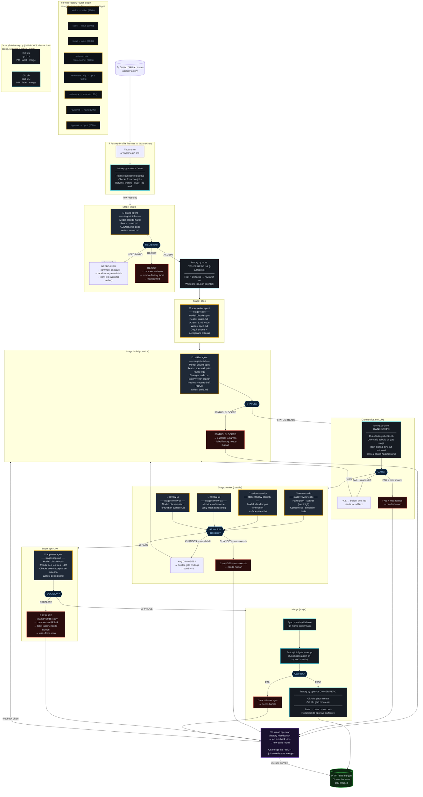

```mermaid
flowchart TD
    %% ── ENTRY POINT ──────────────────────────────────────────
    ISSUES[("🏷 GitHub / GitLab Issues\nlabeled 'factory'")]

    subgraph ORCHESTRATOR["☤ Factory Profile  (hermes -p factory chat)"]
        direction TB
        CMD["/factory run\nor  /factory run &lt;n&gt;"]
        QUEUE["factory.py monitor / start\n──────────────────\nReads open labeled issues\nChecks for active jobs\nReturns: waiting · busy · no work"]
    end

    %% ── STAGE 0: INTAKE ──────────────────────────────────────
    subgraph S_INTAKE["Stage: intake"]
        direction TB
        INTAKE_AGT["🤖 intake agent\n── stage=intake ──\nModel: claude-haiku\nReads: issue.md  AGENTS.md  code\nWrites: intake.md"]
        INTAKE_DEC{{"DECISION?"}}
        NEEDS_INFO["NEEDS-INFO\n→ comment on issue\n→ label factory:needs-info\n→ park job (waits for author)"]
        REJECT["REJECT\n→ comment on issue\n→ remove factory label\n→ job: rejected"]
    end

    %% ── ROUTING ──────────────────────────────────────────────
    ROUTE["factory.py route OWNER/REPO risk [--surfaces s]\n──────────────────\nRisk × Surfaces → reviewer set\nWritten to job.json agents{}"]

    %% ── STAGE 1: SPEC ────────────────────────────────────────
    subgraph S_SPEC["Stage: spec"]
        SPEC_AGT["🤖 spec-writer agent\n── stage=spec ──\nModel: claude-opus\nReads: intake.md  AGENTS.md  code\nWrites: spec.md\n(requirements + acceptance criteria)"]
    end

    %% ── STAGE 2: BUILD ───────────────────────────────────────
    subgraph S_BUILD["Stage: build  (round N)"]
        direction TB
        BUILD_AGT["🤖 builder agent\n── stage=build ──\nModel: claude-opus\nReads: spec.md  prior round logs\nChanges code on factory/&lt;job&gt; branch\nPushes + opens draft PR/MR\nWrites: build.md"]
        BUILD_STATUS{{"STATUS?"}}
        BUILD_BLOCKED["STATUS: BLOCKED\n→ escalate to human\n→ label factory:needs-human"]
    end

    %% ── GATE ─────────────────────────────────────────────────
    subgraph S_GATE["Gate (script, no LLM)"]
        direction TB
        GATE_SCRIPT["factory.py gate OWNER/REPO\n──────────────────\nRuns factory/checks.sh\nOnly valid at build or gate stage\nstdin closed, timeout enforced\nWrites: round-N/checks.md"]
        GATE_DEC{{"GATE?"}}
        GATE_FAIL_LOOP["FAIL → builder gets log\nstarts round N+1"]
        GATE_FAIL_MAX["FAIL + max rounds\n→ needs-human"]
    end

    %% ── REVIEW ───────────────────────────────────────────────
    subgraph S_REVIEW["Stage: review  (parallel)"]
        direction LR
        REV_CODE["🤖 review-code\n── stage=review-code ──\nHaiku (low) · Sonnet (med/high)\nCorrectness · simplicity · tests"]
        REV_SEC["🤖 review-security\n── stage=review-security ──\nModel: claude-opus\n(only when surface=security)"]
        REV_UX["🤖 review-ux\n── stage=review-ux ──\nModel: claude-sonnet\n(only when surface=ui)"]
        REV_UI["🤖 review-ui\n── stage=review-ui ──\nModel: claude-haiku\n(only when surface=ui)"]
        REV_COLLECT{{"All verdicts\ncollected?"}}
        REV_CHANGES["Any CHANGES?\n→ builder gets findings\n→ round N+1"]
        REV_MAX["CHANGES + max rounds\n→ needs-human"]
    end

    %% ── APPROVE ──────────────────────────────────────────────
    subgraph S_APPROVE["Stage: approve"]
        APPROVE_AGT["🤖 approver agent\n── stage=approve ──\nModel: claude-opus\nReads: ALL job files + diff\nChecks every acceptance criterion\nWrites: decision.md"]
        APPROVE_DEC{{"DECISION?"}}
        ESCALATE["ESCALATE\n→ mark PR/MR ready\n→ comment on PR/MR\n→ label factory:needs-human\n→ waits for human"]
    end

    %% ── MERGE ────────────────────────────────────────────────
    subgraph S_MERGE["Merge (script)"]
        direction TB
        MERGE_SYNC["Sync branch with base\n(git merge origin/main)"]
        MERGE_GATE["factory/bin/gate --merge\n(run checks again on synced branch)"]
        MERGE_DEC{{"Gate OK?"}}
        MERGE_FAIL["Gate fail after sync\n→ needs-human"]
        MERGE_EXEC["factory.py open-pr OWNER/REPO\n─────────────────────────────\nGitHub: gh pr create\nGitLab: glab mr create\n─────────────────────────────\nState → done on success\nRolls back to approve on failure"]
    end

    DONE[("✅ PR / MR merged\nCloses the issue\nJob: merged")]

    %% ── HUMAN IN THE LOOP ────────────────────────────────────
    HUMAN["👤 Human operator\n/factory &lt;feedback&gt;\n→ job feedback &lt;id&gt;\n→ new build round\n\nOr: merge the PR/MR\n→ job auto-detects: merged"]

    %% ── DELEGATION ROUTING LEGEND ────────────────────────────
    subgraph ROUTING["hermes-factory-router plugin\ndelegation.backends.factory-router.stages"]
        direction LR
        R1["intake → haiku (120s)"]
        R2["spec   → opus  (300s)"]
        R3["build  → opus  (900s)"]
        R4["review-code → haiku/sonnet (120s)"]
        R5["review-security → opus (180s)"]
        R6["review-ux  → sonnet (120s)"]
        R7["review-ui  → haiku  (90s)"]
        R8["approve → opus (180s)"]
    end

    %% ── VCS BACKENDS ─────────────────────────────────────────
    subgraph VCS["factory/bin/factory.py (built-in VCS abstraction)\nconfig.json: vcs = github | gitlab"]
        direction LR
        GH["GitHub\ngh CLI\nPR · label · merge"]
        GL["GitLab\nglab CLI\nMR · label · merge"]
    end

    %% ── FLOW CONNECTIONS ─────────────────────────────────────
    ISSUES --> ORCHESTRATOR
    CMD --> QUEUE
    QUEUE -->|"new / resume"| S_INTAKE

    INTAKE_AGT --> INTAKE_DEC
    INTAKE_DEC -->|NEEDS-INFO| NEEDS_INFO
    INTAKE_DEC -->|REJECT| REJECT
    INTAKE_DEC -->|ACCEPT| ROUTE
    NEEDS_INFO -->|"author replies"| S_INTAKE

    ROUTE --> S_SPEC
    S_SPEC --> S_BUILD

    BUILD_AGT --> BUILD_STATUS
    BUILD_STATUS -->|"STATUS: READY"| S_GATE
    BUILD_STATUS -->|"STATUS: BLOCKED"| BUILD_BLOCKED
    BUILD_BLOCKED --> HUMAN

    GATE_SCRIPT --> GATE_DEC
    GATE_DEC -->|PASS| S_REVIEW
    GATE_DEC -->|"FAIL + rounds left"| GATE_FAIL_LOOP
    GATE_DEC -->|"FAIL + max rounds"| GATE_FAIL_MAX
    GATE_FAIL_LOOP --> S_BUILD
    GATE_FAIL_MAX --> HUMAN

    REV_CODE & REV_SEC & REV_UX & REV_UI --> REV_COLLECT
    REV_COLLECT -->|"all PASS"| S_APPROVE
    REV_COLLECT -->|"CHANGES + rounds left"| REV_CHANGES
    REV_COLLECT -->|"CHANGES + max rounds"| REV_MAX
    REV_CHANGES --> S_BUILD
    REV_MAX --> HUMAN

    APPROVE_AGT --> APPROVE_DEC
    APPROVE_DEC -->|APPROVE| S_MERGE
    APPROVE_DEC -->|ESCALATE| ESCALATE
    ESCALATE --> HUMAN

    MERGE_SYNC --> MERGE_GATE
    MERGE_GATE --> MERGE_DEC
    MERGE_DEC -->|PASS| MERGE_EXEC
    MERGE_DEC -->|FAIL| MERGE_FAIL
    MERGE_FAIL --> HUMAN
    MERGE_EXEC --> DONE

    HUMAN -->|"feedback given"| S_BUILD
    HUMAN -->|"merged on VCS"| DONE

    %% ── STYLE ────────────────────────────────────────────────
    classDef agent    fill:#1f2937,stroke:#f0a500,color:#e6edf3,stroke-width:2px
    classDef script   fill:#161b22,stroke:#4dd0e1,color:#c9d1d9,stroke-width:2px
    classDef decision fill:#0d2137,stroke:#79c0ff,color:#a5d6ff,stroke-width:1px
    classDef terminal fill:#0d2a12,stroke:#3fb950,color:#c9d1d9,stroke-width:2px
    classDef error    fill:#2a0d0d,stroke:#f85149,color:#c9d1d9,stroke-width:1px
    classDef human    fill:#1a1030,stroke:#a371f7,color:#e6edf3,stroke-width:2px
    classDef routing  fill:#0d1117,stroke:#f0a500,color:#6b7a8d,stroke-width:1px
    classDef vcs      fill:#161b22,stroke:#4dd0e1,color:#c9d1d9,stroke-width:1px

    class INTAKE_AGT,SPEC_AGT,BUILD_AGT,REV_CODE,REV_SEC,REV_UX,REV_UI,APPROVE_AGT agent
    class QUEUE,GATE_SCRIPT,ROUTE,MERGE_SYNC,MERGE_GATE,MERGE_EXEC script
    class INTAKE_DEC,BUILD_STATUS,GATE_DEC,REV_COLLECT,APPROVE_DEC,MERGE_DEC decision
    class DONE terminal
    class REJECT,BUILD_BLOCKED,GATE_FAIL_MAX,REV_MAX,ESCALATE,MERGE_FAIL error
    class HUMAN human
    class R1,R2,R3,R4,R5,R6,R7,R8 routing
    class GH,GL vcs
```
